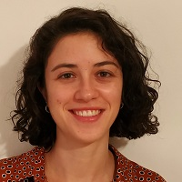

<!-- # Conference Organizers -->

<!-- ## International Program Committee (IPC) -->

<!-- - Dr. Lisa Davis -->
<!-- - Dr. Mark Wilson -->
<!-- - Dr. Laura Miller -->
<!-- - Dr. Andrew Clark -->
<!-- - Dr. Jessica Robinson -->

## Scientific Committee (SPC)

- Marta Bofill Roig (Medical University of Vienna)
- Thomas Asendorf (Medical University of Göttingen)
- Jordi Cortés Martínez (Universitat Politècnica de Catalunya)
- Alexandra Graf  (Medical University of Vienna)
- Sonja Zehetmayer  (Medical University of Vienna)
<!-- - Juan Carbonell Asins (INCLIVA Instituto de Investigación Sanitaria) -->

&nbsp;

## Organizing Committee (LOC)

- Marta Bofill Roig (Medical University of Vienna)
- Thomas Asendorf (Medical University of Göttingen)
- Francesc A. Rosselló Llompart (Universitat de les Illes Balears)
- Irene García Mosquera (Universitat de les Illes Balears)
- Arnau Mir Torres (Universitat de les Illes Balears)

&nbsp;

## Welcome Letter

<!--  |  -->
<!-- :---: | :---: -->
<!-- Dr. John Smith | Dr. Marta Bofill -->

Dear participants,

We are delighted to welcome you to the "Adaptive Designs and Multiple Testing Procedures Workshop"! On behalf of the scientific and organizing committees, we extend our warmest greetings and gratitude for your participation in this esteemed event.

We are honored to bring together leading experts in the field of adaptive designs and multiple testing procedures to share their knowledge and insights. This workshop aims to foster meaningful discussions, exchange innovative ideas, and advance the understanding of statistical methodologies in clinical trials.

<!-- We would like to express our sincere appreciation to the Local Organizing Committee, the International Program Committee, and the Scientific Program Committee for their dedication and hard work in shaping the conference program and ensuring its success. -->

We hope that you find the workshop intellectually stimulating and an excellent opportunity for networking and collaboration. We encourage you to actively engage in the sessions, ask questions, and contribute to the vibrant scientific community.

Once again, we extend our warmest welcome and wish you a fruitful and memorable workshop experience.

Best regards,

Scientific and organizing committees
